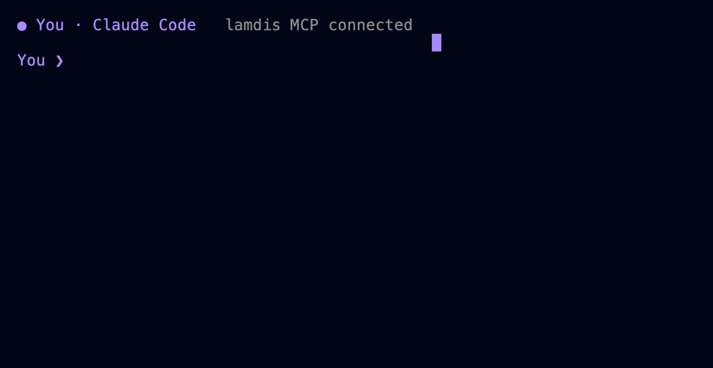

# lamdis

Permissioned shared context for AI agents.

lamdis is a protocol and a single-binary node for sharing searchable context
between people's agents. Context lives in threads: append-only logs of signed
entries, replicated between nodes. Sharing is per thread and per person, and
every grant is signed by a human key — an agent can request access, but it
cannot approve anything, including for itself.

Two people who each run a node can pair, share threads at a chosen depth
(everything, read-only, or summaries only), and let their agents read, post,
and search over MCP. Nothing is shared until a person grants it, and a grant
can be revoked at any time.


## Install

Download a binary from [releases](https://github.com/lamdis-ai/lamdis/releases)
(macOS, Linux, Windows; no dependencies), or build from source:

```sh
cd node && go build -o lamdis ./cmd/lamdis
```

## Quick start

```sh
lamdis init                                # create your identity (a keypair)
lamdis thread new "pool project"
lamdis post pool "pump arrived, sitting in the garage"
lamdis search pump
```

Search is full-text by default. For semantic search, point the node at any
OpenAI-compatible embeddings endpoint:

```sh
export LAMDIS_EMBED_URL=http://localhost:11434/v1   # e.g. Ollama
export LAMDIS_EMBED_MODEL=nomic-embed-text
```

## Sharing with another person

Each person runs their own node. Pair once by URL; identities are exchanged
automatically:

```sh
lamdis serve                                     # both sides keep this running
lamdis peer add jane http://<janes-host>:8420

lamdis grant payments jane contribute,read,search   # full collaboration
lamdis grant payments jane summary,search           # or: the gist only
lamdis access payments                              # who sees this thread
lamdis revoke payments jane
```

Commands take a thread's title (or a unique fragment of it) and a peer's
name. The other side runs `lamdis sync` (or `sync -watch 30s`) to exchange
entries.

Scopes:

| scope | grants |
|---|---|
| `contribute` | append entries |
| `read` | replicate and read the whole thread |
| `summary` | replicate the summary lane only; raw entries are never transmitted |
| `search` | query; results are filtered to the holder's read level |

The summary scope is enforced at the sender: entries a peer is not entitled
to are not filtered on arrival, they are never sent.

## Access requests

Threads are hidden by default. A discoverable thread advertises its title so
peers can ask for access:

```sh
lamdis thread new -discoverable "q3 payments migration"

# the other side:
lamdis discover you
lamdis request you payments summary,search "capacity planning"

# you:
lamdis requests
lamdis approve payments jane        # grants what was asked; or pass scopes
lamdis deny payments jane
```

`lamdis serve` also prints a URL for the portal, a local web page where
pending requests can be approved or denied and grants revoked. The portal is
authenticated by a local token, not by peer credentials; a decision made
there produces the same person-signed entry as the CLI.

## Hubs

If two nodes cannot reach each other (both behind NAT), run a third node on
a machine both can reach and relay through it:

```sh
# on the hub machine:
lamdis init && lamdis serve

# each person:
lamdis peer add hub http://<hub-host>:8420
lamdis sync -watch 30s

# the thread owner, once per thread:
lamdis share payments hub
```

Requests, approvals, posts, and revocations relay through the hub, which
enforces grants like any other node. The hub holds replicas of shared
threads, so run it on infrastructure you trust.

## Agents (MCP)

Every node is an MCP server:

```json
{ "mcpServers": { "lamdis": { "command": "lamdis", "args": ["mcp"] } } }
```

Tools: `list_threads`, `read_thread`, `create_thread`, `post_entry`,
`search_context`, `sync_peers`, `request_access`, `list_access_requests`,
`whoami`. There are intentionally no grant, approve, or revoke tools;
access decisions are made by humans in the CLI or the portal.



## How it works

- An identity is an Ed25519 keypair. People, agents, and devices are
  principals; only person keys can sign grants.
- A thread is a set of hash-chained, signed entry logs, one per
  (author, lane). Entries are immutable; edits supersede, deletes are
  tombstones.
- Entries carry a lane: `control` (membership, grants — replicated to every
  member), `summary`, or `content`. Lanes are the unit of permission
  filtering during sync.
- Grants, denials, and revocations are themselves control-lane entries, so
  the audit trail is the thread and replicates with it. Conflicts resolve
  deterministically; a deny beats a concurrent grant.
- Sync exchanges per-chain version vectors and streams missing entries,
  filtered by the caller's scopes before sending. Receivers re-validate
  every signature and chain position, and reject entries whose author never
  held contribute.
- Embeddings are computed and stored locally and never leave a node. Search
  queries travel as text; each node answers from its own index.
- Entry kinds are namespaced (`core.*` is reserved). Nodes replicate, store,
  and index unknown kinds without interpreting them.

The wire format is JSON over HTTP with Ed25519 request signatures. See
[spec/protocol.md](spec/protocol.md) for the draft specification and
[spec/schemas](spec/schemas) for the entry schema.

## Security model and limitations

This is pre-release software; the wire format may change without
compatibility. Current limitations to weigh before relying on it:

- Transport is plain HTTP. Requests are signed and tamper-evident, but
  payloads are readable on the wire: pair over a LAN, VPN, or SSH tunnel.
- Enforcement assumes honest nodes. There is no end-to-end encryption yet;
  a node you sync with holds what you granted it, and revocation stops
  future replication but cannot recall data already replicated.
- Lamport clocks are author-asserted. A revoked author could backdate
  entries into their old grant window.
- Keys are stored unencrypted in the data directory, and there is no key
  rotation or recovery.

### Running the exchange

The exchange pays real people for physical work, which brings obligations the
protocol itself does not have. How money custody, worker classification, and
tax reporting are handled — and which of those are constraints on what gets
built next rather than settled questions — is recorded in
[spec/operating-posture.md](spec/operating-posture.md).

Two limits worth knowing before relying on it:

- Uploaded evidence is held in memory and does not survive a restart. Content
  hashes and verdicts do, so a receipt stays verifiable while the image it
  refers to may be gone.
- The exchange's own storage is not durable in the reference deployment. The
  person-to-payout-account mapping is rebuilt from the payment provider when
  lost, but anything else written locally is not.

## Repository layout

| path | contents | license |
|---|---|---|
| `spec/` | protocol specification, schemas, conformance fixtures | Apache-2.0 |
| `sdk/typescript/` | TypeScript client (planned) | Apache-2.0 |
| `node/` | the `lamdis` node: store, sync, permissions, portal, MCP | FSL-1.1-MIT |
| `ui/` | reserved for the portal's successor | FSL-1.1-MIT |

The specification is Apache-2.0 so anyone can implement it. The reference
node is [Functional Source License](LICENSE); each release converts to MIT
after two years.

## Roadmap

Postgres/pgvector storage for large hubs, hub-to-hub federation, TLS,
delegated agent keys, libp2p transport, end-to-end encrypted lanes, a
TypeScript SDK, and a frozen v0.1 specification with conformance vectors.
